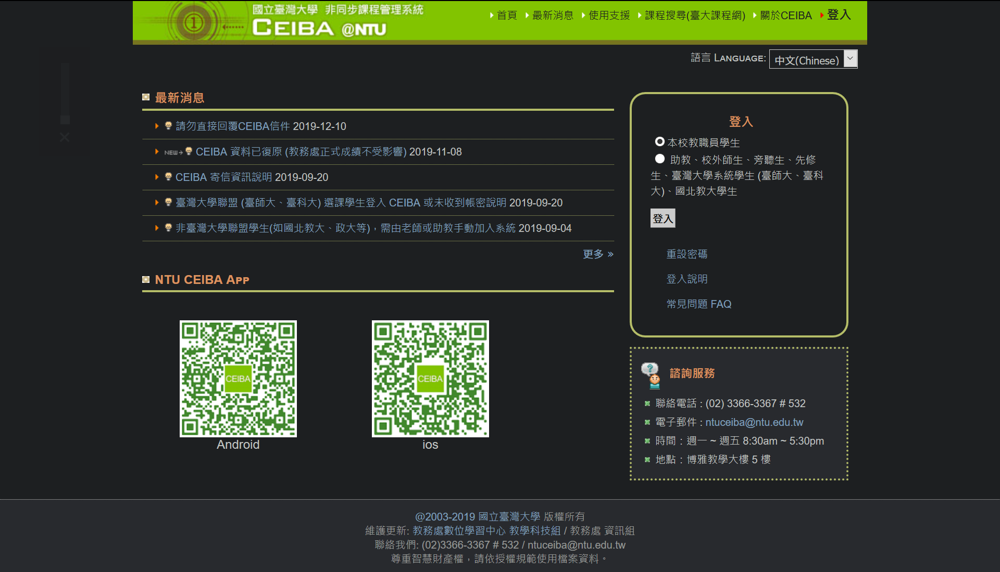
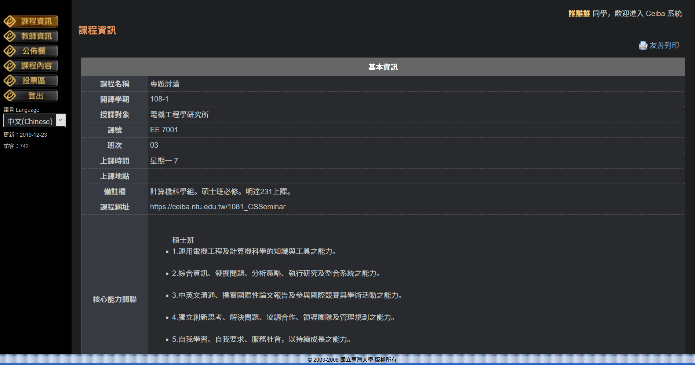

# Dark NTU Ceiba

半夜讀書的我快被亮瞎了。

Use at your own risk.

## How to use

- Install **Stylus**: [Firefox Extension](https://addons.mozilla.org/zh-TW/firefox/addon/styl-us/)
- [🕶 Install The UserCSS](https://raw.githubusercontent.com/undecV/Dark-NTU-Ceiba/master/DarkNTUCeiba.user.css)
    - or, in the [UserCSS file](./DarkNTUCeiba.user.css) page, clilk `RAW`.
- Once the raw file is open in the browser, Stylus will open a new tab. Then `install` UserCSS.

## Screenshot

